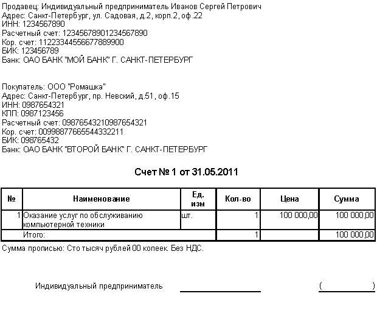

# Тестовое задание №1

---

** !!!!!!! НЕ АКТУАЛЬНО !!!!!!!! **

---

На вакансию Middle PHP-разработчик (Yii2)

**Формирование счета на оплату**

---

Сделать форму генерации счетов на оплату

## Подробности задания:

1. Развернуть через composer Yii2 проект в сборке basic.

2. Создать там модуль. В модуле сделать следующий функционал:

- сделать контроллер и экшен, где пользователь вбивает свои реквизиты и сумму оплаты, после чего ему генерируется счет на оплату на выставленную сумму (в формате HTML)
- пример счета прикрепляю ниже
- сделать экшен для возможности просмотра всех созданных ранее счетов
- регистрацию/авторизацию не делаем (ролями пренебрегаем - все видят всё)

3. Нужно использовать миграции и composer. Результат загрузить в репозиторий на github или bitbucket. Скинуть мне ссылку.

## Требования:

- Приложение должно быть написано на Yii2 Framework (сборка Basic) для PHP 7.0.
- Весь код должен быть расположен в модуле.
- В качестве фронт-енд стека желательно использовать Bootstrap 3 + jQuery.
- В качестве базы необходимо использовать MySQL.
- Все изменения схемы базы данных должны проводиться через миграции.
- Код должен быть документирован на русском языке. Классы и методы должны содержать нотацию в формате phpDoc.
- В корневой директории модуля необходимо разместить файл README.md, где нужно описать на русском языке основные принципы работы этого модуля. С расчетом на то, чтобы вы или разработчик вашего уровня смог через год спокойно разобраться в этом коде.
- Готовый код разместить в Github и скинуть на него ссылку.

## Полезные материалы:

Пример счета:

