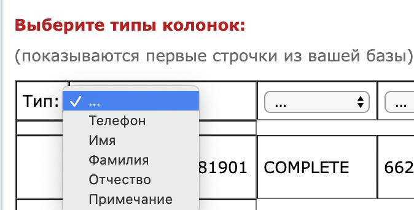

# Тестовое задание №4

---

** !!!!!!! НЕ АКТУАЛЬНО !!!!!!!! **

---

На вакансию Middle PHP-разработчик (Yii2)

**Импорт данных из файла `Excel` или `CSV` с выбором распределения данных по таблице**

---

Создать форму для импорта данных из файла `Excel` или `CSV` с выбором распределения данных по таблице перед импортом.

## Подробности задания:

1. Развернуть через Composer приложение `Yii2 Framework` в cборке `Basic`.
2. Через миграции создать таблицу `merchant_products`:

```
id - Основной идентификатор
int(11)
NOT NULL
AUTO_INCREMENT

created_at - timestamp-метка создания записи (в формате UNIX-time)
int(11)
NOT NULL

vendor_code - артикул товара
varchar(255)
DEFAULT NULL

title - название товара
varchar(300)
NOT NULL

price - актуальная цена
int(11)
DEFAULT NULL

old_price - старая цена
int(11)
DEFAULT NULL

image - Изображение товара
varchar(255)
DEFAULT NULL

quantity - Количество товара
int(11)
DEFAULT NULL
```

3. Создать модель для этой таблицы.
4. Создать экшен для загрузки `CSV` или `Excel` (`csv`, `xls`, `xlsx`) файла.
5. Если потребуется, то запросить следующие настройки импорта:
    - Кодировка
    - Разделитель
6. После обработки файла вывести содержимое файла в виде таблицы (пока не заносим в базу).
7. В заголовках столбцов отобразить выпадающие списки, элементами которых являются столбцы таблицы `merchant_products` (кроме полей `id` и `created_at`). См. пример на изображении.
8. Таким образом пользователь должен расставить соответствие колонок из файла столбцам таблицы `merchant_products`.
9. Ниже таблицы должна быть кнопка "Импортировать записи".
9. После нажатия на кнопку данные из файла должны импортироваться в таблицу `merchant_products` с учетом указанных соответствий полей.
10. Поля `id` и `created_at` должны проставиться автоматически.
11. После импорта необходимо отобразить GridView с данными из таблицы `merchant_products`.

**Проработать следующие моменты:**

- в пункте 4: неправильный формат файла.
- в пункте 8: пользователь не может указать для двух колонок файла указать одно и то же значение столбца таблицы `merchant_products`.
- в пункте 8: пользователь не может импортировать записи, не указав ни одной колонки.

## Требования:

- Приложение должно быть написано на `Yii2 Framework` (сборка `Basic`) для `PHP 7.0`.
- В качестве фронт-енд стека желательно использовать `Bootstrap 3` + `jQuery`.
- В качестве базы необходимо использовать `MySQL`.
- Все изменения схемы базы данных должны проводиться через миграции.
- Код должен быть документирован на русском языке. Классы и методы должны содержать нотацию в формате `phpDoc`.
- В корневой директории проекта необходимо разместить файл README.md, где нужно описать на русском языке основные принципы работы этого модуля. С расчетом на то, чтобы вы или разработчик вашего уровня смог через год спокойно разобраться в этом коде.
- Готовый код разместить в Github и скинуть на него ссылку.
- В репозитории разместить один или несколько `CSV`/`Excel`-файлов, с помощью которых можно протестировать ваш код.

## Полезные материалы:

Пример заголовков столбцов:




